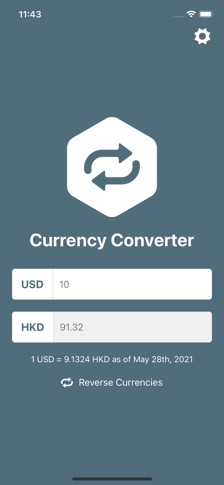
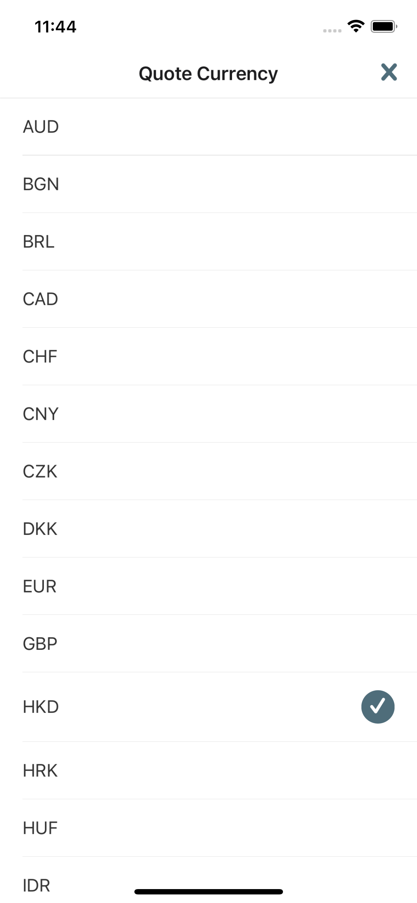

# React Native Practice Test: Build a Currency Converter

## Requirements:
Given the existing code, please complete the Currency Converter app with below requirements:
1. Changing currency (either base or quote currency) in CurrencyList will close the pop-up and update Home screen with selected currency.
2. Result value in Home screen will be re-calculated based on the exchange rate of new currency pair. The data source for exchange rates is already given in App/util/api.js

## Screenshots:
1. Home Screen:

2. Currency List:

## Installation

- This project requires Expo. To install Expo follow [these instructions](https://expo.io/learn).
- Clone/download the project
- From the project directory, run `npm install` or `yarn install`

## Running

- iOS: `npm run ios`/`yarn run ios`
- Android: `npm run android`/`yarn run android`
